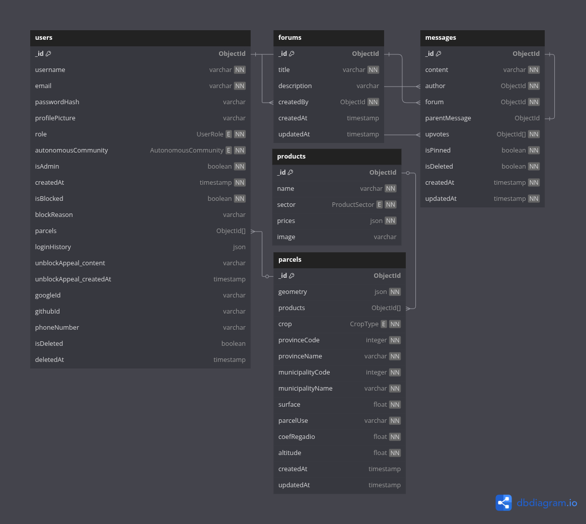

<p align="center">
  
</p>

<h1 align="center">
  AgroNET Backend
</h1>

## Documentación

### Proyecto

La documentación general del proyecto se encuentra en **[/doc/README](<[https](https://github.com/STW-24-25/Backend/blob/main/doc/README.md)>)**

### API

La documentación swagger se encuentra en la ruta `/api/docs` de la API, con su versión JSON en `/api/docs/json`.

## Versiones de las principales dependencias

- NodeJS v22.14.0
- npm v11.1.0

## Testing

Los tests utilizan MongoDB Memory Server para crear una base de datos en memoria durante la ejecución de pruebas. Esto permite que los tests se ejecuten de forma aislada sin afectar a la base de datos de producción.

Para ejecutar los tests:

```bash
npm run test
```

Para ejecutar los tests con cobertura:

```bash
npm run test:coverage
```

### Nota para CI/CD

Los tests en entornos de CI/CD (GitHub Actions) pueden requerir la instalación de `libssl1.1` para que MongoDB Memory Server funcione correctamente. Esto ya está configurado en los archivos de workflow.

## Estructura de datos


