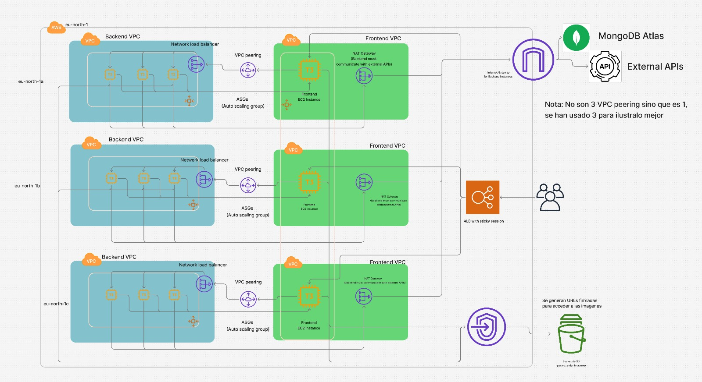

<p align="center">
  
</p>

<h1 align="center">Infraestructura AgroNet en AWS (2025)</h1>

El directorio **[aws/prod](https://github.com/STW-24-25/Backend/tree/main/aws/prod)** contiene las plantillas de CloudFormation para desplegar la infraestructura completa de AgroNet en AWS.

## Arquitectura

<p align="center">
   
</p>

La arquitectura implementada consiste en:

- **2 VPCs** (Frontend y Backend) con peering entre ellas
- **3 zonas de disponibilidad** para alta disponibilidad
- **6 subredes por VPC** (3 públicas y 3 privadas)
- **1 Application Load Balancer (ALB)** como punto de entrada
- **3 Network Load Balancers (NLB)** para distribuir el tráfico entre zonas
- **Frontend**: Instancias EC2 con aplicación Astro
- **Backend**: Auto Scaling Groups (ASG) con Launch Templates
- **Base de datos**: MongoDB Atlas (servicio externo)

## Estructura de directorios

```
prod/
├── main.yml                   # Plantilla principal
├── main-s3.yml                # Plantilla principal para despliegue desde S3
├── compute/
│   ├── frontend-compute.yml   # Recursos de cómputo para Frontend
│   └── backend-compute.yml    # ASG y Launch Templates para Backend
├── network/
│   ├── vpc.yml                # VPCs, subredes, tablas de rutas, etc.
│   └── load-balancers.yml     # ALB, NLBs y Target Groups
└── security/
    └── security-groups.yml    # Grupos de seguridad
```

## Prerrequisitos

1. Una cuenta de AWS con permisos de administrador
2. Un Key Pair de EC2 creado en la región eu-north-1
3. Una conexión de MongoDB Atlas activa
4. Un bucket S3 para almacenar las plantillas
5. Un token de acceso personal (fine-grained) de GitHub para acceder a los repositorios

## Seguridad y configuración de acceso a GitHub

Esta infraestructura utiliza AWS Secrets Manager para almacenar de forma segura el token de GitHub, que permite a las instancias acceder a los repositorios privados. El token se utiliza durante el despliegue inicial y luego se eliminan las credenciales del sistema para mayor seguridad.

### Generación de un token de GitHub

1. Inicia sesión en GitHub
2. Ve a Settings > Developer settings > Personal access tokens > Fine-grained tokens
3. Crea un token con los siguientes permisos mínimos:
   - Acceso de lectura a los repositorios necesarios (Frontend y Backend)
   - Duración apropiada (e.g., 30 días, 60 días, etc.)
4. Copia el token generado y úsalo en el despliegue

## Opciones de despliegue

### Opción 1: Despliegue desde la Consola Web de AWS

1. **Crear un bucket S3 para las plantillas**:

   a. Inicia sesión en la consola web de AWS
   b. Ve al servicio S3
   c. Crea un nuevo bucket (por ejemplo: `agronet-cloudformation-templates-XXXX`)
   d. Deshabilita el "Bloqueo de acceso público" si vas a compartir las plantillas con otros usuarios
   e. Habilita el versionado para el control de versiones de las plantillas
   f. Completa la creación del bucket

2. **Subir las plantillas a S3**:

   a. Dentro del bucket, crea la siguiente estructura de carpetas:

   - `/prod`
   - `/prod/compute`
   - `/prod/network`
   - `/prod/security`

   b. Sube cada archivo YAML a la carpeta correspondiente:

   - `main.yml` en la carpeta `/prod`
   - Los archivos de compute en `/prod/compute`
   - Los archivos de network en `/prod/network`
   - Los archivos de security en `/prod/security`

3. **Modificar referencias de plantilla**:

   Edita el archivo `main.yml` para que las rutas `TemplateURL` apunten a los archivos en el bucket S3:

   ```yaml
   # Ejemplo original:
   # TemplateURL: ./network/vpc.yml

   # Modificado para S3:
   TemplateURL: https://agronet-cloudformation-templates-XXXX.s3.eu-north-1.amazonaws.com/prod/network/vpc.yml
   ```

   > Repite este cambio para todas las referencias `TemplateURL` en el archivo `main.yml`

4. **Lanzar el stack desde la consola de CloudFormation**:

   a. Ve al servicio CloudFormation en la consola de AWS
   b. Haz clic en "Crear stack" > "Con nuevos recursos (estándar)"
   c. En la pantalla "Especificar plantilla":

   - Selecciona "URL de Amazon S3"
   - Ingresa la URL del archivo main.yml en tu bucket:
     `https://agronet-cloudformation-templates-1000.s3.eu-north-1.amazonaws.com/prod/main.yml`
   - Haz clic en "Siguiente"

   d. En la pantalla "Especificar detalles del stack":

   - Ingresa un nombre para el stack (por ejemplo: "agronet-infrastructure")
   - Completa los parámetros:
     - EnvironmentName: prod (o el entorno que desees)
     - KeyName: El nombre de tu par de claves EC2
     - MongoDBConnectionString: Tu cadena de conexión a MongoDB Atlas
     - GitHubToken: Tu token de acceso personal de GitHub
   - Haz clic en "Siguiente"

   e. En "Configurar opciones del stack":

   - Define roles IAM, políticas de pilas y opciones avanzadas si es necesario
   - Haz clic en "Siguiente"

   f. En "Revisar":

   - Revisa todos los detalles y confirma
   - Marca la casilla para reconocer que CloudFormation podría crear recursos IAM
   - Haz clic en "Crear stack"

5. **Monitorear el progreso**:

   a. Observa la pestaña "Eventos" para seguir el progreso del despliegue
   b. Una vez completado, revisa la pestaña "Salidas" para obtener la URL del ALB

### Opción 2: Despliegue desde la CLI de AWS

1. **Preparar el bucket S3**:

   ```bash
   # Crear el bucket S3 (reemplaza XXXX con un identificador único)
   aws s3 mb s3://agronet-cloudformation-templates-XXXX --region eu-north-1

   # Habilitar el versionado
   aws s3api put-bucket-versioning \
     --bucket agronet-cloudformation-templates-XXXX \
     --versioning-configuration Status=Enabled

   # Crear la estructura de carpetas y subir archivos
   aws s3 cp . s3://agronet-cloudformation-templates-XXXX/prod/ \
     --recursive --region eu-north-1
   ```

2. **Preparar parámetros**:

   Crear un archivo `parameters.json` con los siguientes parámetros:

   ```json
   [
     {
       "ParameterKey": "EnvironmentName",
       "ParameterValue": "prod"
     },
     {
       "ParameterKey": "KeyName",
       "ParameterValue": "TU_KEY_PAIR_NOMBRE"
     },
     {
       "ParameterKey": "MongoDBConnectionString",
       "ParameterValue": "TU_MONGODB_CONEXION"
     },
     {
       "ParameterKey": "GitHubToken",
       "ParameterValue": "TU_GITHUB_TOKEN"
     }
   ]
   ```

3. **Desplegar la infraestructura**:

   ```bash
   aws cloudformation create-stack \
     --stack-name agronet-infrastructure \
     --template-url https://agronet-cloudformation-templates-XXXX.s3.eu-north-1.amazonaws.com/prod/main.yml \
     --parameters file://parameters.json \
     --capabilities CAPABILITY_NAMED_IAM \
     --region eu-north-1
   ```

4. **Verificar el despliegue**:

   ```bash
   aws cloudformation describe-stacks \
     --stack-name agronet-infrastructure \
     --region eu-north-1
   ```

5. **Obtener la URL del ALB**:

   ```bash
   aws cloudformation describe-stacks \
     --stack-name agronet-infrastructure \
     --query "Stacks[0].Outputs[?OutputKey=='ALBDNSName'].OutputValue" \
     --output text \
     --region eu-north-1
   ```

## Despliegue modular (Stack por Stack) en la Consola Web de AWS

Si prefieres desplegar la infraestructura módulo por módulo para tener un mayor control sobre el proceso de despliegue, sigue estos pasos detallados:

### Paso 1: Preparación del Bucket S3

1. Crea un bucket S3 siguiendo los pasos mencionados anteriormente
2. Sube todos los archivos YAML a sus respectivas carpetas en el bucket
3. Configura las ACL del bucket para permitir el acceso a las plantillas

### Paso 2: Despliegue del Stack de Red (NetworkStack)

1. Ve a la consola de AWS CloudFormation
2. Haz clic en "Crear stack" > "Con nuevos recursos (estándar)"
3. En "Especificar plantilla", selecciona "URL de Amazon S3" e ingresa:

   ```
   https://agronet-cloudformation-templates-XXXX.s3.eu-north-1.amazonaws.com/prod/network/vpc.yml
   ```

4. Haz clic en "Siguiente"
5. Nombra el stack: `prod-network-stack`
6. Completa los parámetros:
   - EnvironmentName: prod
   - VPCFrontendCIDR: 10.0.0.0/16 (o el valor que prefieras)
   - VPCBackendCIDR: 10.1.0.0/16 (o el valor que prefieras)
   - PublicSubnet1CIDRFrontend: 10.0.0.0/24
   - ... (completa todos los parámetros CIDR)
7. Haz clic en "Siguiente", configura opciones avanzadas si es necesario
8. Revisa y crea el stack
9. Espera a que el stack se complete (estado CREATE_COMPLETE)
10. Anota los valores de salida (Outputs) para usarlos en los siguientes stacks. Los más importantes son:
    - `prod-Frontend-VPC-ID`
    - `prod-Backend-VPC-ID`
    - `prod-Frontend-VPC-CIDR`
    - `prod-Backend-VPC-CIDR`
    - Los IDs de todas las subredes

### Paso 3: Despliegue del Stack de Seguridad (SecurityStack)

1. Ve a la consola de AWS CloudFormation
2. Haz clic en "Crear stack" > "Con nuevos recursos (estándar)"
3. En "Especificar plantilla", selecciona "URL de Amazon S3" e ingresa:

   ```
   https://agronet-cloudformation-templates-XXXX.s3.eu-north-1.amazonaws.com/prod/security/security-groups.yml
   ```

4. Haz clic en "Siguiente"
5. Nombra el stack: `prod-security-stack`
6. Completa los parámetros:
   - EnvironmentName: prod (debe coincidir con el valor usado en el NetworkStack)
7. Haz clic en "Siguiente", configura opciones avanzadas si es necesario
8. Revisa y crea el stack
9. Espera a que el stack se complete (estado CREATE_COMPLETE)
10. Anota los valores de salida (Outputs) para usarlos en los siguientes stacks. Los más importantes son:
    - `prod-ALB-SecurityGroup`
    - `prod-Frontend-SecurityGroup`
    - `prod-NLB-SecurityGroup`
    - `prod-Backend-SecurityGroup`

### Paso 4: Despliegue del Stack de Balanceadores de Carga (LoadBalancerStack)

1. Ve a la consola de AWS CloudFormation
2. Haz clic en "Crear stack" > "Con nuevos recursos (estándar)"
3. En "Especificar plantilla", selecciona "URL de Amazon S3" e ingresa:

   ```
   https://agronet-cloudformation-templates-XXXX.s3.eu-north-1.amazonaws.com/prod/network/load-balancers.yml
   ```

4. Haz clic en "Siguiente"
5. Nombra el stack: `prod-loadbalancer-stack`
6. Completa los parámetros:
   - EnvironmentName: prod (debe coincidir con el valor usado en los stacks anteriores)
7. Haz clic en "Siguiente", configura opciones avanzadas si es necesario
8. Revisa y crea el stack
9. Espera a que el stack se complete (estado CREATE_COMPLETE)

### Configuración manual del dominio personalizado en Route 53

Si prefieres configurar manualmente el registro de alias en Route 53 para tu dominio personalizado en lugar de usar CloudFormation, sigue estos pasos:

1. **Requisitos previos**:

   - Tener un dominio registrado en Don Dominio (o cualquier otro registrador)
   - Haber configurado una zona alojada en Route 53 para tu dominio
   - Tener un certificado validado en ACM (AWS Certificate Manager) para tu dominio

2. **Configurar los servidores de nombres en Don Dominio**:

   a. Inicia sesión en tu cuenta de Don Dominio
   b. Navega a la gestión de tu dominio
   c. Busca la sección "Servidores DNS" o "Nameservers"
   d. Reemplaza los nameservers actuales con los cuatro servidores de nombres de tu zona alojada de Route 53:

   ```
   ns-xxxx.awsdns-xx.com
   ns-xxxx.awsdns-xx.net
   ns-xxxx.awsdns-xx.org
   ns-xxxx.awsdns-xx.co.uk
   ```

   e. Guarda los cambios
   f. La propagación DNS puede tardar hasta 48 horas, pero normalmente es más rápida

3. **Crear un registro de alias en Route 53**:

   a. Inicia sesión en la consola de AWS
   b. Ve al servicio Route 53
   c. Selecciona "Zonas alojadas" en el panel de navegación
   d. Selecciona la zona alojada para tu dominio
   e. Haz clic en "Crear registro"
   f. Configura el registro con los siguientes valores:

   - **Nombre**: Introduce tu subdominio (ej. "agronet") o deja en blanco para el dominio raíz
   - **Tipo**: A - Dirección IPv4
   - **Alias**: Activa esta opción
   - **Destino del alias**: Selecciona "Application and Classic Load Balancer"
   - **Región**: Selecciona la región donde está desplegado tu ALB (ej. eu-north-1)
   - **Balanceador de carga**: Selecciona tu ALB de la lista (ej. prod-AgroNet-ALB)
   - **Política de enrutamiento**: Simple
   - **Evaluación del estado del destino**: No (a menos que desees habilitar esta función)
     g. Haz clic en "Crear registros"

4. **Verificar la configuración**:

   a. Espera unos minutos para que el registro se propague
   b. Abre un navegador web y accede a tu dominio personalizado (ej. agronet.ejemplo.com)
   c. Deberías ver tu aplicación cargada correctamente a través de HTTPS

5. **Solución de problemas comunes**:

   - **El sitio no carga**: Verifica que los servidores de nombres estén correctamente configurados en Don Dominio
   - **Error de certificado SSL**: Asegúrate de que el certificado ACM incluya el dominio y subdominio exacto que estás usando
   - **Error 502/503**: Verifica que tu ALB y las instancias estén funcionando correctamente

Esta configuración manual de Route 53 te permitirá tener un control completo sobre tus registros DNS y te facilitará la integración con servicios de autenticación como OAuth de Google y GitHub, así como con reCAPTCHA, ya que estos servicios requieren dominios públicos verificados.

### Paso 5: Despliegue del Stack de Backend (ComputeBackendStack)

1. Ve a la consola de AWS CloudFormation
2. Haz clic en "Crear stack" > "Con nuevos recursos (estándar)"
3. En "Especificar plantilla", selecciona "URL de Amazon S3" e ingresa:

   ```
   https://agronet-cloudformation-templates-XXXX.s3.eu-north-1.amazonaws.com/prod/compute/backend-compute.yml
   ```

4. Haz clic en "Siguiente"
5. Nombra el stack: `prod-backend-stack`
6. Completa los parámetros:
   - EnvironmentName: prod
   - KeyName: tu_key_pair
   - BackendInstanceType: t3.small (o el tipo que prefieras)
   - MinSize: 1
   - MaxSize: 3
   - DesiredCapacity: 2
   - MongoDBConnectionString: tu_string_de_conexión
   - GitHubToken: tu_token_de_github
7. Haz clic en "Siguiente", configura opciones avanzadas si es necesario
8. Revisa y crea el stack
9. Espera a que el stack se complete (estado CREATE_COMPLETE)

### Paso 6: Despliegue del Stack de Frontend (ComputeFrontendStack)

1. Ve a la consola de AWS CloudFormation
2. Haz clic en "Crear stack" > "Con nuevos recursos (estándar)"
3. En "Especificar plantilla", selecciona "URL de Amazon S3" e ingresa:

   ```
   https://agronet-cloudformation-templates-XXXX.s3.eu-north-1.amazonaws.com/prod/compute/frontend-compute.yml
   ```

4. Haz clic en "Siguiente"
5. Nombra el stack: `prod-frontend-stack`
6. Completa los parámetros:
   - EnvironmentName: prod
   - KeyName: tu_key_pair
   - FrontendInstanceType: t3.small (o el tipo que prefieras)
   - GitHubToken: tu_token_de_github
7. Haz clic en "Siguiente", configura opciones avanzadas si es necesario
8. Revisa y crea el stack
9. Espera a que el stack se complete (estado CREATE_COMPLETE)

### Paso 7: Verificación de la Infraestructura Completa

1. Una vez completados todos los stacks, ve a EC2 > Balanceadores de carga
2. Localiza el ALB creado (prod-AgroNet-ALB)
3. Copia el DNS Name (por ejemplo: prod-AgroNet-ALB-1234567890.eu-north-1.elb.amazonaws.com)
4. Abre un navegador web y accede a la aplicación usando la URL copiada

### Consideraciones importantes para el despliegue modular

- **Orden de dependencias**: Es crucial seguir el orden exacto de los pasos anteriores debido a las dependencias entre recursos
- **Nombres de los stacks**: Asegúrate de usar nombres consistentes para los parámetros EnvironmentName en todos los stacks
- **Valores de exportación**: Cada stack exporta valores que son utilizados por los stacks subsiguientes según se detalla a continuación:

  **NetworkStack exporta**:

  - VPC IDs: `${EnvironmentName}-Frontend-VPC-ID`, `${EnvironmentName}-Backend-VPC-ID`
  - VPC CIDRs: `${EnvironmentName}-Frontend-VPC-CIDR`, `${EnvironmentName}-Backend-VPC-CIDR`
  - Subnet IDs: `${EnvironmentName}-Frontend-Public-Subnet-X-ID`, `${EnvironmentName}-Backend-Private-Subnet-X-ID` (donde X es 1, 2 o 3)
  - Route Table IDs: `${EnvironmentName}-Frontend-Public-RouteTable-ID`, `${EnvironmentName}-Backend-Public-RouteTable-ID`

  **SecurityStack exporta**:

  - Security Group IDs: `${EnvironmentName}-ALB-SecurityGroup`, `${EnvironmentName}-Frontend-SecurityGroup`, `${EnvironmentName}-NLB-SecurityGroup`, `${EnvironmentName}-Backend-SecurityGroup`

  **LoadBalancerStack exporta**:

  - ALB DNS Name: `${EnvironmentName}-ALB-DNS`
  - Target Group ARNs: `${EnvironmentName}-Frontend-TG-ARN`, `${EnvironmentName}-Backend-TG1-ARN`, etc.

- **Eliminación de stacks**: Para eliminar la infraestructura, debes eliminar los stacks en orden inverso: Frontend → Backend → LoadBalancer → Security → Network
- **Verificación entre pasos**: Antes de proceder con el siguiente stack, asegúrate de que el stack actual esté en estado CREATE_COMPLETE y que todos sus outputs sean correctos
- **Resolución de errores comunes**:
  - Si recibes un error "No export named X found", significa que un stack está tratando de importar un valor que aún no ha sido exportado. Verifica que el stack que debe exportar ese valor se haya desplegado correctamente.
  - Para el error "Frontend-VPC-CIDR not found", asegúrate de que el NetworkStack se haya desplegado completamente y haya exportado correctamente este valor.

## Actualización de la infraestructura

Para actualizar la infraestructura después de modificar las plantillas:

1. Sube las plantillas actualizadas al bucket S3
2. Desde la consola de CloudFormation:
   - Selecciona el stack específico que deseas actualizar
   - Haz clic en "Actualizar"
   - Selecciona "Usar plantilla actual" o proporciona la URL S3 actualizada
   - Sigue los pasos para completar la actualización

## Renovación del token de GitHub

El token de GitHub tiene una fecha de caducidad. Para actualizar el token cuando expire:

1. Genera un nuevo token en GitHub
2. Actualiza el secreto en AWS Secrets Manager:

   ```bash
   aws secretsmanager update-secret \
     --secret-id prod-github-token \
     --secret-string "nuevo_token_de_github" \
     --region eu-north-1
   ```

3. Si es necesario, actualiza todas las instancias o reinicia los servicios para aplicar el nuevo token

## Limpieza

### Eliminación de stacks individuales

Para eliminar la infraestructura desplegada módulo por módulo, sigue estos pasos en orden inverso:

1. **Eliminar Stack de Frontend**:

   - Ve a CloudFormation
   - Selecciona el stack `prod-frontend-stack`
   - Haz clic en "Eliminar" y confirma

2. **Eliminar Stack de Backend**:

   - Selecciona el stack `prod-backend-stack`
   - Haz clic en "Eliminar" y confirma

3. **Eliminar Stack de Load Balancers**:

   - Selecciona el stack `prod-loadbalancer-stack`
   - Haz clic en "Eliminar" y confirma

4. **Eliminar Stack de Security Groups**:

   - Selecciona el stack `prod-security-stack`
   - Haz clic en "Eliminar" y confirma

5. **Eliminar Stack de Red**:
   - Selecciona el stack `prod-network-stack`
   - Haz clic en "Eliminar" y confirma

## Notas importantes

- Esta arquitectura está optimizada para alta disponibilidad y escalabilidad
- Los NLBs establecen conexiones con los ASG del Backend
- El ALB distribuye el tráfico entre las instancias Frontend
- Las instancias Backend están en subredes privadas con acceso a Internet a través de NAT Gateways
- Los ASG escalan automáticamente basados en el uso de CPU (70%)
- El despliegue modular permite mayor control sobre cada componente, pero requiere administrar manualmente las dependencias entre stacks
